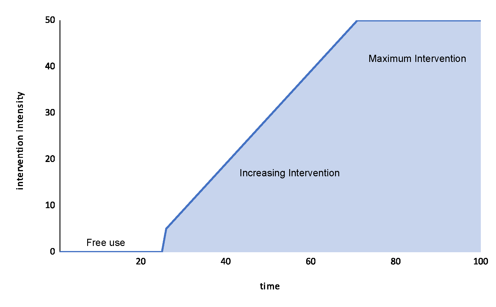

# InteractOut: Leveraging Interaction Proxies as Input Manipulation Strategies for Reducing Smartphone Overuse

InteractOut is a smartphone overuse intervention tool that use Interaction Proxies [1] techniques to make users’ touch input less usable in order to reduce users’ desire to continue using smartphone.

This is the source code of InteractOut. See [Video](https://drive.google.com/file/d/1xvOINBRq7q5QfQX264acldPrVT7J8bUo/view?usp=sharing) for the brief introduction.

---

# Guide

## Prerequisites

- Android Studio with latest version
- An Android device with API level higher than 29. It can be either an emulator or a physical device.

## Installation

### Debug package

In this way, you will quickly download InteractOut app in debug mode.

1. Clone this repo to your local machine.
2. Open it in Android Studio.
3. Click “Run ‘app’” to build and run it.

### Signed package

In this way, you will get an apk file that can be delivered freely. You need to create a key store to do it. 

1. Click ‘Build’ on the navigation bar
2. Choose ‘apk’.
3. Choose your key store.
4. Choose ‘release’ build variant

## InteractOut Mechanism Description

### Timing

Unlike traditional intervention techniques which consists of two states (time limit reached/not reached), InteractOut has three states: free use, increasing intervention, maximum intervention. This is because some interventions of InteractOut are continuous, which is able to provide more subtle control and therefore it is able to nudge rather than force users to stop usage.

Here is a diagram illustrating the timing mechanism of InteractOut.

Note that there is a sudden jump when users enter the increasing intervention stage. The reason is that there is perceivable inherent delay necessary for gesture detection. 

### Intervention

There are eight interventions in total:

- Tap Delay: it postpones the time for the users’ tap to take effect;
- Tap Prolong: it only allows the tap with the finger staying on the screen longer than a threshold;
- Tap Shift: it shifts the function position away from the actual tap position;
- Tap Double: it requires double tap to trigger a single tap;
- Swipe Delay: it postpones the time for the users’ swipe to take effect;
- Swipe Scale: it changes the replay time of the users’ swipe;
- Swipe Multiple Fingers: it requires users to use more than one finger to swipe.
- Swipe Reverse: it reverses the direction of the users’ swipe;

Tap Delay, Tap Prolong, Swipe Delay and Swipe Scale are continuous. Other interventions are discrete so the above timing control is not applicable to them. 

## User Interface Description

The original main interface is used for the field study, in which the user has fixed configurations of apps and interventions. If you want to have free control, go to `AndroidManifest.xml` and set `PanelActivity` as the LAUNCH activity (it is DEFAULT currently)

### Home Page (main for common users)

In home page, you can select arbitrary combination of interventions. After choosing your target apps and setting time limit for each of them, you are ready to go! You can also mannually configure the intervention parameters yourself.

### Field Study Page (main page for field study participants)

Field Study Page is only used for the field study of InteractOut. Participants cannot change any setting, including the applications they want to control usage, the combination of interventions or the time limit. Everything is fixed for study purposes.

### User Page (main page for users)

User Page is the main page for general users. The user is able choose the target applications, the time limits for each application and the combination of interventions. The icons on this page allows users to quickly choose the combination of interventions with default intensities. Users are able to change them in the Customization Page.

### Customization Page

Customization Page is the control panel of all interventions. Users can adjust these sliders to change the values of the intervention they use.

# Reference
[1] Xiaoyi Zhang, Anne Spencer Ross, Anat Caspi, James Fogarty, and Jacob O. Wobbrock. 2017. Interaction Proxies for Runtime Repair and Enhancement of Mobile Application Accessibility. *In Proceedings of the 2017 CHI Conference on Human Factors in Computing Systems* (Denver, Colorado, USA) (*CHI ’17*). Association for Computing Machinery, New York, NY, USA, 6024–6037. https://doi.org/10.1145/3025453.3025846
